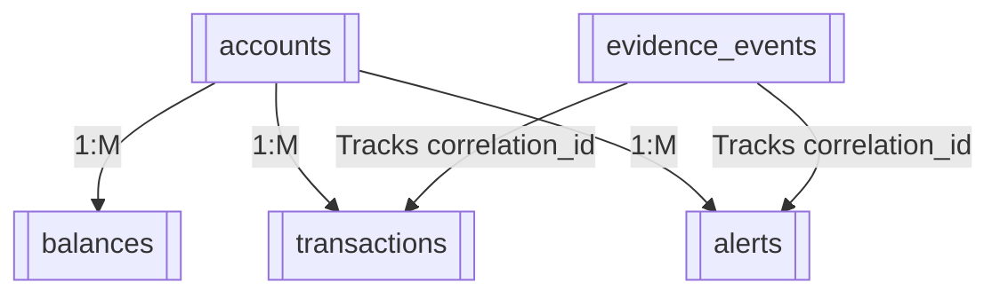
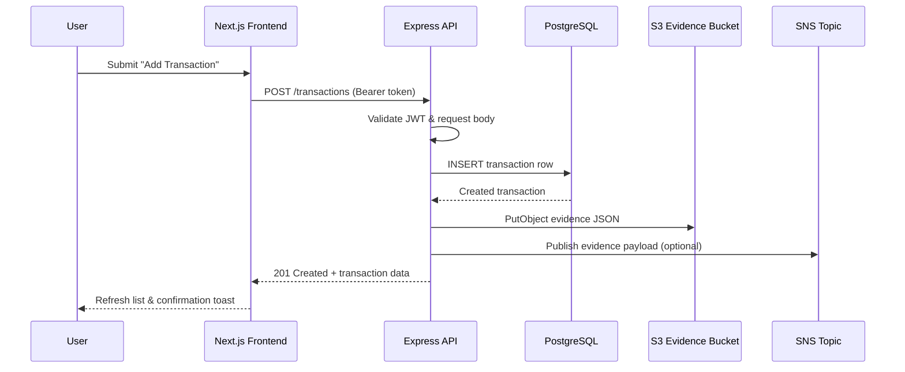

# Beyla Sandbox Architecture Overview

This document provides an end-to-end description of the Beyla sandbox platform, spanning the mobile-friendly Next.js client, the Express-based API, the PostgreSQL data tier, and the AWS services that provide observability, storage, and deployment. Use it as a high-level reference when onboarding, designing changes, or explaining how the pieces collaborate in production and local environments.

## System context

The diagram below highlights the core actors and the managed services that participate in a typical session. Cognito and AWS services are shown as external dependencies, while the frontend, API, and database layers live in this repository.

```mermaid
graph LR
  User[Operator on Mobile or Desktop]
  Browser[Next.js Frontend (frontend/)]
  Cognito[AWS Cognito Hosted UI]
  API[Express API (beyla-sandbox-api/)]
  Postgres[(RDS PostgreSQL)]
  S3[S3 Evidence Bucket]
  SNS[SNS Topic + SQS Queue]

  User -->|https| Browser
  Browser -->|OIDC redirect| Cognito
  Cognito -->|ID/Access tokens| Browser
  Browser -->|JWT-auth API calls| API
  API -->|SQL queries| Postgres
  API -->|Evidence JSON| S3
  API -->|Event fan-out| SNS
```

* Operators authenticate with Cognito (or the local mock mode) and interact with the responsive dashboard running in Next.js.【F:frontend/lib/auth-context.tsx†L1-L256】
* Authenticated requests are sent to the Express API, which enforces JWT verification and mounts the health, balance, transaction, and alert routes behind shared middleware for correlation, rate limiting, and error handling.【F:beyla-sandbox-api/src/index.ts†L1-L61】【F:beyla-sandbox-api/src/middlewares/auth.ts†L1-L50】
* The API persists business data to PostgreSQL and writes audit evidence to S3 and SNS so downstream systems can replay or monitor events.【F:beyla-sandbox-api/src/db/migrations/0001_init.sql†L1-L48】【F:beyla-sandbox-api/src/services/evidence.ts†L1-L57】
* Infrastructure components—VPC, ECS, RDS, S3, SNS/SQS, IAM, and supporting security groups—are provisioned with Terraform under `infra-aws/` for parity across environments.【F:infra-aws/main.tf†L1-L76】

## Component responsibilities

### Frontend (`frontend/`)

* **Authentication context** stores Cognito tokens (or mock credentials) in `localStorage`, exposes sign-in/out helpers, and decodes JWT payloads for user metadata.【F:frontend/lib/auth-context.tsx†L1-L256】
* **Data hooks** encapsulate API fetches for balances, transactions, alerts, and evidence links, automatically attaching bearer tokens and normalizing errors for UI components.【F:frontend/lib/api.ts†L1-L190】
* **UI composition** uses a responsive shell with Tailwind and shadcn-inspired primitives to present dashboard KPIs, transaction modals, alert badges, and settings forms.

### API (`beyla-sandbox-api/`)

* **HTTP pipeline** adds JSON parsing, permissive CORS, request correlation, Pino request logging, and rate limiting before delegating to route handlers.【F:beyla-sandbox-api/src/index.ts†L1-L61】
* **Auth middleware** validates bearer tokens with the configured JWT secret and projects identity metadata onto the Express `req.user` object.【F:beyla-sandbox-api/src/middlewares/auth.ts†L1-L50】
* **Request context middleware** exposes the correlation ID, actor, and client IP to downstream handlers so audit records stay consistent.【F:beyla-sandbox-api/src/middlewares/request-context.ts†L1-L26】
* **Data access layer** wraps SQL queries for listing balances and transactions, creating ledger entries, and recording alert payloads, providing the shapes consumed by both API and frontend.【F:beyla-sandbox-api/src/db/account-repository.ts†L1-L118】
* **Evidence pipeline** writes structured JSON documents to S3 under the agreed key prefix and optionally publishes the same payload to SNS for observability. Each write also logs metadata into the `evidence_events` table for traceability.【F:beyla-sandbox-api/src/services/evidence.ts†L1-L57】【F:beyla-sandbox-api/src/services/audit-log.ts†L1-L19】

### Data model

The initial migration defines the relational schema for accounts, balances, transactions, alerts, and evidence events used by the sandbox and its audit tooling.【F:beyla-sandbox-api/src/db/migrations/0001_init.sql†L1-L48】



## Request lifecycle

The following sequence illustrates what happens when an operator submits a new transaction from the dashboard:



* The frontend uses the `useTransactions` hook to post the request and refresh its local state once the API responds.【F:frontend/lib/api.ts†L93-L142】
* The route handler validates input, writes the transaction, emits evidence, and returns the normalized payload for the UI.【F:beyla-sandbox-api/src/routes/transactions.ts†L1-L95】
* `recordEvidenceEvent` captures the S3 key and correlation ID in Postgres so operators can audit what was written to object storage.【F:beyla-sandbox-api/src/services/audit-log.ts†L1-L19】

## Alert and audit flow

Alerts follow the same evidence pipeline and expose a presigned evidence URL through `/alerts/:id/evidence`, which the frontend resolves when an operator taps "View evidence". Evidence payloads mirror the S3 content path `env=<env>/date=<YYYY-MM-DD>/corr=<UUID>/event-<ISO>.json`, helping downstream analysis tools segment by environment and request correlation.【F:beyla-sandbox-api/src/routes/alerts.ts†L1-L72】【F:beyla-sandbox-api/src/services/evidence.ts†L21-L57】

## Deployment topology

Terraform composes reusable modules for the AWS environment:

* **Networking** – VPC with public and private subnets, plus discrete security groups for the ALB and ECS service.【F:infra-aws/main.tf†L15-L38】
* **Compute** – ECS Fargate service running the API container with an HTTPS Application Load Balancer and health checks against `/health/ready`.【F:infra-aws/main.tf†L59-L76】
* **Stateful services** – RDS PostgreSQL instance and S3 evidence bucket bound to the task role via IAM policies.【F:infra-aws/main.tf†L23-L51】
* **Observability fan-out** – SNS topic and SQS subscription for agent event monitoring, plus optional consumers (e.g., analytics, alerting bots).【F:infra-aws/main.tf†L53-L58】

When deploying, publish a new API image to ECR, update the Terraform variables (`image_url`, `task_environment`, `task_secrets`), and apply. The frontend can be hosted on Vercel, CloudFront, or an additional ECS service configured with the same Cognito environment.

## Local development workflow

1. **Database** – `docker compose up -d db` boots the Postgres container, and `npm run migrate && npm run seed` prepares sample data.【F:readme.md†L16-L37】
2. **API** – `npm run dev` launches the Express server with hot reload, writing evidence to the configured bucket or logging warnings if AWS credentials are absent.【F:beyla-sandbox-api/src/index.ts†L1-L61】
3. **Frontend** – Run `npm run dev` in `frontend/` with `NEXT_PUBLIC_ENABLE_MOCK_AUTH=true` to bypass Cognito and exercise the UI against `http://localhost:8080`.【F:frontend/README.md†L20-L43】【F:frontend/lib/auth-context.tsx†L1-L205】

## Security and compliance considerations

* JWT validation protects all non-health routes and propagates principal metadata into audit records for attribution.【F:beyla-sandbox-api/src/middlewares/auth.ts†L1-L50】【F:beyla-sandbox-api/src/middlewares/request-context.ts†L18-L25】
* Every mutating request writes an immutable JSON trail to S3 and, optionally, SNS for monitoring tools to consume. Evidence keys include the environment, event date, and correlation ID to simplify retention policies and investigations.【F:beyla-sandbox-api/src/routes/transactions.ts†L59-L89】【F:beyla-sandbox-api/src/services/evidence.ts†L21-L57】
* IAM roles from Terraform grant the ECS task least-privilege access to read secrets and write evidence objects, keeping database credentials in AWS Secrets Manager rather than baked into images.【F:infra-aws/main.tf†L40-L76】

## Extensibility roadmap

* **Analytics consumers** can subscribe to the `agent-events` queue for near-real-time monitoring without modifying the API layer.【F:infra-aws/main.tf†L53-L58】
* **Cognito integration** in production simply requires disabling mock auth and configuring the Hosted UI domain, client ID, and redirect URLs—no code changes needed thanks to the runtime environment variables.【F:frontend/lib/auth-context.tsx†L200-L248】
* **Additional domains** (e.g., payments, KYC) can extend the API by adding new route modules and repositories while reusing the existing middleware, audit pipeline, and Terraform scaffolding.
