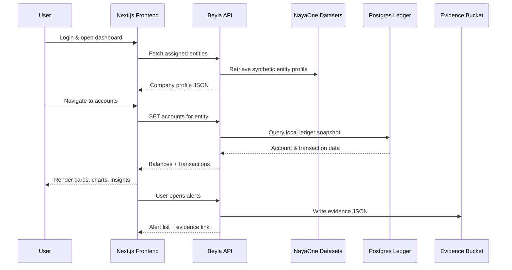

# Synthetic data user journey

This guide explains how the synthetic NayaOne datasets that ship with the Beyla sandbox materialise as the screens an SME operator experiences. Use it when designing walkthroughs, onboarding colleagues, or validating that sample entities stay consistent across the experience.

## Core personas and datasets

| Persona | Dataset(s) | Purpose |
| --- | --- | --- |
| **SME operator** | Synthetic UK Business Entities | Provides the canonical company identity, profile fields, and incorporation metadata that appear across the dashboard and profile pages. |
| **Bank relationship manager** | Synthetic UK Business Current Accounts | Supplies account numbers, balances, cashflow markers, and the raw material for transaction timelines. |
| **Compliance analyst** | Evidence trail emitted by Beyla API | Captures an immutable JSON footprint for every read/write call so auditors can replay user actions. |

Each dataset record is joined by `entity_id` so that the company an operator manages has a consistent profile, accounts, and ledger activity across the application.

## Walkthrough from login to audit

1. **Login & landing dashboard**  
   The sandbox session assigns the operator one or more synthetic entities. When the user signs in they are greeted with the company name, high-level KPIs, and AI insight cards derived from the latest account balances and transaction aggregates.
2. **Company profile view**  
   Pulls directly from the Synthetic Entities dataset. Present the business name, type, sector, turnover band, headcount, address, and incorporation date so operators recognise their “business”.
3. **Accounts & balances workspace**  
   Filters the Synthetic UK Business Current Accounts dataset to the active `entity_id`. Render account numbers, currency, product type, available and ledger balances, and a sparkline of recent balance movements.
4. **Transactions explorer**  
   Joins the account details with generated or imported transaction rows. Display date, description, direction (credit/debit), amount, and resulting balance. Use the feed to drive charts such as income vs spend and top categories.
5. **Alerts & insights**  
   Runs light rules (e.g. “expenses exceed income for 3 weeks” or “large incoming credit detected”) on the transaction stream. Surface them as alert cards or AI assistant messages, storing the reasoning alongside the dataset metadata for traceability.
6. **Audit evidence trail**  
   Every frontend interaction that fetches balances, transactions, or alerts triggers the API to write an evidence JSON document to S3 and optionally publish it to SNS. The payload includes the operator identity, correlation ID, action performed, affected entity, and timestamp.

## Visual cheat sheet

## Implementation checklist

- [ ] Ensure the sandbox assigns a deterministic `entity_id` to each session so profile, accounts, and alerts stay in sync.
- [ ] Cache dataset lookups or ingest them into Postgres to avoid rate limits when seeding demo environments.
- [ ] When mocking AI narratives, store the generated message alongside the underlying numeric trend so the story matches future retraining.
- [ ] Use the evidence correlation ID to power observability dashboards and playback tools for compliance demos.

By following this journey, the synthetic NayaOne datasets feel like a cohesive digital banking experience while keeping every interaction auditable.
